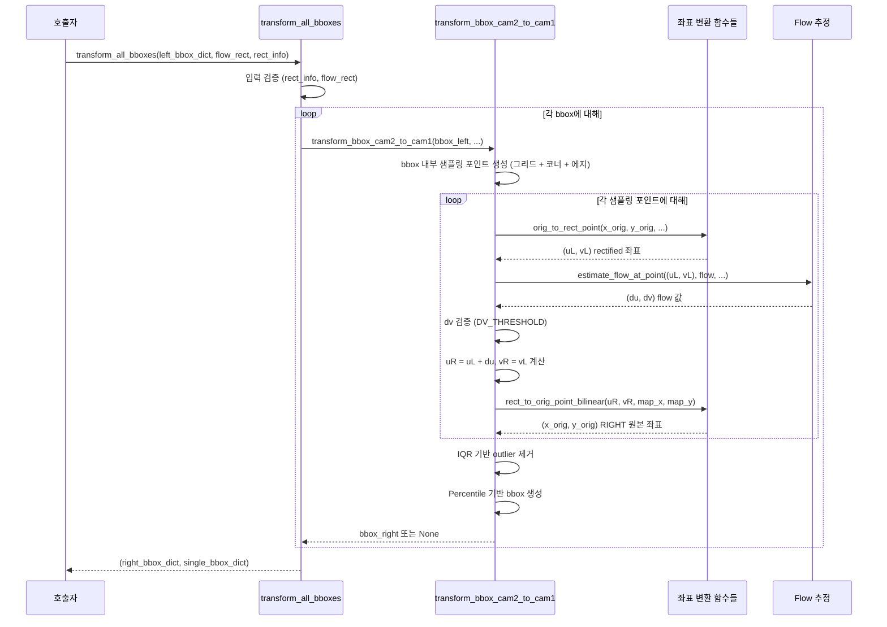
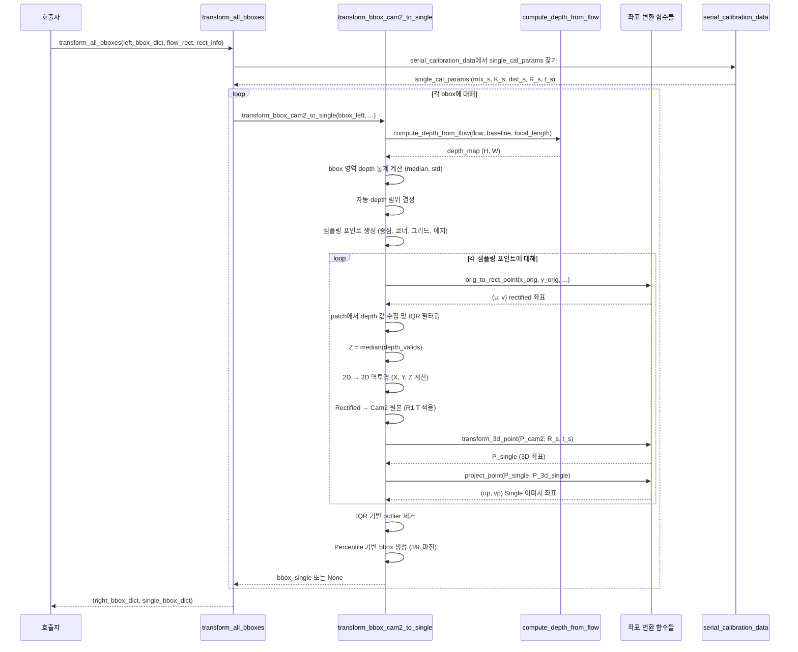
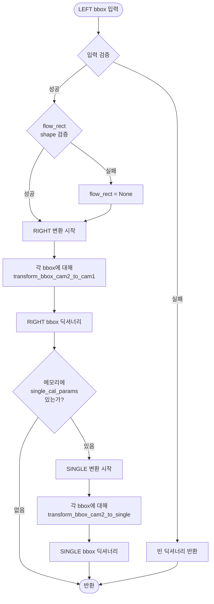

# bbox_transformer 모듈 문서

## 개요

`bbox_transformer` 모듈은 3개 카메라 시스템에서 LEFT 카메라(Cam2)의 bounding box를 다른 카메라(RIGHT/Cam1, SINGLE/Cam3)로 변환하기 위한 좌표 변환 모듈입니다. 

LEFT 카메라에서 검출된 객체의 bbox를 다른 카메라 뷰로 정확하게 변환하여, 멀티뷰 시스템에서 일관된 객체 추적과 분석을 가능하게 합니다.

## 주요 기능

- **LEFT → RIGHT 변환**: RAFT flow 기반으로 rectified 좌표계를 통해 변환
- **LEFT → SINGLE 변환**: 3D 좌표계 변환을 통한 정밀한 투영
- **Outlier 제거**: IQR 기반 통계적 필터링으로 변환 오차 최소화
- **메모리 기반 캘리브레이션**: 싱글 캘리브레이션 파라미터를 메모리에서 직접 로드하여 성능 최적화

## 상수 정의

```python
DV_THRESHOLD = 2.0          # rectified stereo에서 y좌표 차이 임계값 (픽셀)
PATCH_RADIUS = 2            # Flow 추정 시 사용할 patch 반경 (노이즈에 덜 민감하게)
IQR_MULTIPLIER = 1.5        # IQR 기반 outlier 제거 배수
BBOX_MARGIN = 0.03          # bbox 확장 마진 (3%)
PERCENTILE_LOW = 2          # 낮은 percentile (outlier 제거용)
PERCENTILE_HIGH = 98        # 높은 percentile (outlier 제거용)
```

### 상수 설명

- **DV_THRESHOLD**: Rectified stereo 이미지에서 좌우 카메라의 y좌표는 이론적으로 동일해야 합니다. 이 임계값을 초과하는 경우 잘못된 flow로 판단하여 제외합니다.
- **PATCH_RADIUS**: Flow 추정 시 사용할 patch 반경입니다. 2로 설정하여 노이즈에 덜 민감하게 처리합니다.
- **IQR_MULTIPLIER**: Interquartile Range 기반 outlier 제거 시 사용되는 배수입니다. 1.5는 일반적으로 사용되는 값으로, Q1 - 1.5×IQR ~ Q3 + 1.5×IQR 범위 밖의 값을 제거합니다.
- **BBOX_MARGIN**: 변환된 bbox에 추가되는 여유 공간입니다. 변환 오차를 보정하기 위해 3%의 마진을 추가합니다.
- **PERCENTILE_LOW/HIGH**: 변환된 좌표들 중 경계 outlier를 제거하기 위해 사용됩니다. 하위 2%와 상위 2%를 제외하여 안정적인 bbox를 생성합니다.

## 주요 함수

### 헬퍼 함수

#### _filter_depth_with_iqr
IQR 기반 필터링을 사용하여 depth 값 추정. depth_valids 배열에서 outlier를 제거한 후 median을 반환합니다.

#### _estimate_depth_at_point
Rectified 좌표계의 특정 포인트에서 depth 값을 추정합니다. patch 영역에서 depth 값을 수집하고, use_weighted_average가 True이고 depth 값이 8개 이상일 때 거리 역가중치 기반 가중 평균을 사용합니다. 그 외에는 IQR 필터링 후 median을 사용합니다.

#### _generate_sample_points
Bbox에서 샘플링 포인트를 생성합니다. 중심, 코너 4개, 그리드 포인트, 에지 중점을 포함합니다.

#### rgb_bbox_to_raft_bbox
RGB 좌표계(1280x960)의 bbox 좌표를 RAFT 좌표계(768x480)로 변환합니다.

**변환 과정**:
1. RGB (1280x960) → 크롭된 원본 (1600x1200)
2. 크롭된 원본 → 원본 (1920x1200, 오프셋 추가)
3. 원본 → 스케일된 원본 (resize_scale 적용)
4. 스케일된 원본 → RAFT 캔버스 (resize_crop 오프셋 추가)

#### raft_bbox_to_rgb_bbox
RAFT 좌표계(768x480)의 bbox 좌표를 RGB 좌표계(1280x960)로 역변환합니다.

**역변환 과정**:
1. RAFT 캔버스 → 스케일된 원본 (resize_crop 오프셋 제거)
2. 스케일된 원본 → 원본 (resize_scale 역적용)
3. 원본 → 크롭된 원본 (ori_crop 오프셋 제거)
4. 크롭된 원본 → RGB (1280x960, 비율 변환)

**참고**: 이 함수들은 `transform_all_bboxes` 내부에서 자동으로 호출되며, 사용자가 직접 호출할 필요는 없습니다.

=====================================================================================
### 1. orig_to_rect_point

**목적**: 원본 이미지 좌표를 rectified 이미지 좌표로 변환

**파라미터**:
- `x_orig, y_orig`: 원본 이미지 좌표 (float)
- `K`: 카메라 내부 파라미터 (3×3 numpy array)
- `dist`: 왜곡 계수 (numpy array)
- `R_rect`: Rectification 회전 행렬 (3×3 numpy array)
- `P_rect`: Rectification 투영 행렬 (3×4 numpy array)

**동작**:
- OpenCV의 `cv2.undistortPoints`를 사용하여 왜곡 보정 및 rectification 수행
- 단일 포인트 변환에 최적화

**반환값**: `(u, v)` - Rectified 이미지 좌표 (Tuple[float, float])
=====================================================================================
### 2. rect_to_orig_point_bilinear

**목적**: Rectified 이미지 좌표를 원본 이미지 좌표로 변환

**파라미터**:
- `u_rect, v_rect`: Rectified 이미지 좌표 (float)
- `map_x, map_y`: Remap 맵 (rect→orig, numpy array)

**동작**:
- Bilinear 보간을 사용하여 서브픽셀 정확도로 변환
- 4개 인접 픽셀의 가중 평균 계산

**반환값**: `(x, y)` - 원본 이미지 좌표 또는 `None` (범위 밖인 경우)
=====================================================================================
### 3. sample_flow_bilinear

**목적**: Bilinear 보간으로 flow 샘플링 (서브픽셀 정확도)

**파라미터**:
- `x, y`: 샘플링할 좌표 (float)
- `flow`: Flow map (H, W) 또는 (H, W, C) numpy array

**동작**:
- 서브픽셀 좌표에서 flow 값을 bilinear 보간으로 계산
- 유효하지 않은 값(NaN, Inf) 검사

**반환값**: `(du, dv)` - Flow 값 또는 `None` (범위 밖이거나 유효하지 않은 경우)
=====================================================================================
### 4. estimate_flow_at_point

**목적**: Rectified Cam2 기준 포인트 주변의 flow 추정

**파라미터**:
- `pt_r`: (x, y) rectified 좌표 (Tuple[float, float])
- `flow`: Flow map (H, W) 또는 (H, W, 2) numpy array
- `patch_radius`: Patch 반경 (int, 기본값 1)

**동작**:
1. `patch_radius <= 1`이면 bilinear 보간 우선 시도
2. 실패 시 patch 영역의 median 또는 trimmed mean 사용
3. 유효한 값만 사용하여 노이즈 제거

**반환값**: `(du, dv)` - Flow 값 또는 `None`
=====================================================================================
### 5. transform_bbox_cam2_to_cam1

**목적**: Cam2(LEFT) bbox를 Cam1(RIGHT) bbox로 변환

**파라미터**:
- `bbox_cam2_orig`: Cam2 원본 이미지의 bbox [x1, y1, x2, y2] (List[float])
- `flow_left_to_right_rect`: LEFT→RIGHT rectified flow map (H, W, 2) numpy array
- `rect_info`: Rectification 정보 딕셔너리
- `img_cam1_shape`: Cam1 이미지 크기 (H, W) (Tuple[int, int])

**Note**: `patch_radius` 파라미터는 제거되었으며, 내부적으로 `PATCH_RADIUS` 상수(2)를 사용합니다.

**변환 과정**:
1. **LEFT orig → LEFT rect**: `orig_to_rect_point`를 사용하여 왜곡 보정 및 rectification
2. **Flow로 RIGHT rect 계산**: `uR = uL + du`, `vR = vL` (stereo rectified에서 y는 동일)
3. **RIGHT rect → RIGHT orig**: `rect_to_orig_point_bilinear`을 사용하여 원본 좌표로 변환
4. **Outlier 제거**: IQR 기반 필터링 및 percentile 사용
5. **Bbox 생성**: 변환된 좌표들로부터 새로운 bbox 계산

**샘플링 전략**:
- bbox 내부를 그리드로 샘플링 (간격: bbox 크기의 1/10)
- 코너 4개, 센터, 에지 중점 4개를 필수 포함
- 최소 2개 이상의 유효한 변환 포인트 필요

**반환값**: Cam1 원본 이미지의 bbox [x1, y1, x2, y2] 또는 `None`
=====================================================================================
### 6. project_point

**목적**: 3D 점을 투영 행렬 P(3×4)로 이미지 좌표로 투영

**파라미터**:
- `P`: 투영 행렬 (3×4 numpy array)
- `point_3d`: 3D 점 (X, Y, Z) (Tuple 또는 List)

**동작**:
- 동차 좌표계로 변환 후 투영 행렬 적용
- Z값이 0에 가까우면 `None` 반환 (무한대 투영 방지)

**반환값**: `(u, v)` - 이미지 좌표 또는 `None`
=====================================================================================
### 7. transform_3d_point

**목적**: 3D 포인트를 다른 카메라 좌표계로 변환

**파라미터**:
- `P_3d`: 3D 포인트 (numpy array 또는 List)
- `R`: 회전 행렬 (3×3 numpy array)
- `t`: 이동 벡터 (3×1 또는 1×3 numpy array)

**동작**:
- `P_transformed = R @ P_3d + t` 계산
- 좌표계 변환 (예: Cam2 → Pillar)

**반환값**: 변환된 3D 포인트 (numpy array, shape: (3,))
=====================================================================================
=====================================================================================
### 9. transform_bbox_cam2_to_single

**목적**: Cam2(LEFT) bbox를 Single 카메라 bbox로 변환

**파라미터**:
- `bbox_cam2_orig`: Cam2 RAFT 좌표계의 bbox [x1, y1, x2, y2] (RAFT 해상도 기준: 768x480)
- `flow_left_to_right_rect`: LEFT→RIGHT rectified flow map (RAFT 해상도 기준: 768x480)
- `rect_info`: Rectification 정보 딕셔너리
- `R_cam2_to_single`: Cam2→Single 회전 행렬 (3×3 numpy array)
- `t_cam2_to_single`: Cam2→Single 이동 벡터 (3×1 numpy array)
- `K_single`: Single 카메라 내부 파라미터 (3×3 numpy array)
- `img_cam2_shape`: Cam2 이미지 크기 (H, W) (Tuple[int, int])
- `img_single_shape`: Single 이미지 크기 (H, W) (Tuple[int, int])
- `min_depth`: 최소 depth (mm) (float, 기본값 200.0)
- `max_depth`: 최대 depth (mm) (float, 기본값 500.0)
- `depth_map_rect`: rectified 좌표계의 depth map (None이면 좌표변환 스킵)

**변환 과정**:
1. **Depth map 필터링**: min_depth, max_depth 범위로 필터링
2. **샘플링 포인트 생성**: `_generate_sample_points`로 중심, 코너, 그리드, 엣지 포인트 생성
3. **Depth 추정**: 각 샘플링 포인트에서 `_estimate_depth_at_point`로 depth 값 추정
   - 중심점: 거리 역가중치 기반 가중 평균 사용 (8개 이상일 때)
   - 기타 포인트: IQR 필터링 후 median 사용
4. **2D → 3D 역투영**: rectified 좌표계의 3D 좌표 계산
   - `X_rect = (u - cx) × Z / fx`
   - `Y_rect = (v - cy) × Z / fy`
   - `Z = depth`
5. **Rectified → Cam2 원본 좌표계**: `R1.T` 적용
6. **Cam2 → Single 좌표계**: `R_cam2_to_single`, `t_cam2_to_single` 적용
7. **3D → Single 이미지 2D 투영**: `K_single @ [I|0]` 투영 행렬 사용
8. **Outlier 제거**: IQR 기반 필터링 및 percentile 사용
9. **Bbox 생성**: 변환된 좌표들로부터 새로운 bbox 계산 (3% 마진 포함)
10. **범위 검증**: 이미지 범위를 벗어나면 실패 처리 (클램핑 없음)

**샘플링 전략**:
- 중심, 코너 4개 필수 포함
- bbox 크기에 따라 그리드 샘플링 (최대 5×5)
- 에지 중점 포함 (bbox 크기 > 10픽셀)
- 각 포인트 타입별로 다른 patch_radius 사용 (corner: bbox/25, center: bbox/15 등)

**Depth 추정 전략**:
- 각 샘플링 포인트 주변 patch에서 depth 값 수집
- 중심점: 8개 이상일 때 거리 역가중치 기반 가중 평균, 그 외 IQR 필터링 후 median
- 기타 포인트: IQR 기반 outlier 제거 후 median 사용

**헬퍼 함수**:
- `_generate_sample_points`: 샘플링 포인트 생성
- `_estimate_depth_at_point`: 특정 포인트에서 depth 추정
- `_filter_depth_with_iqr`: IQR 기반 depth 필터링

**반환값**: Single RAFT 좌표계의 bbox [x1, y1, x2, y2] (RAFT 해상도 기준: 768x480) 또는 `None`

**Note**:
- 좌표계 변환(RGB ↔ RAFT)은 호출자(transform_all_bboxes)에서 처리됩니다.
- 이 함수는 RAFT 좌표계 기준으로 동작합니다.
- 이미지 범위를 벗어나면 클램핑하지 않고 실패로 처리합니다.
=====================================================================================
### 10. transform_all_bboxes

**목적**: LEFT 기준 bbox 딕셔너리를 RIGHT와 SINGLE로 일괄 변환 (메인 진입점)

**파라미터**:
- `left_bbox_dict`: LEFT 카메라 기준 bbox 딕셔너리 {obj_idx: [x1, y1, x2, y2], ...} (dict)
  - 좌표는 RGB 해상도(1280x960) 기준
- `flow_rect`: LEFT→RIGHT rectified flow map (H, W, 2) numpy array
- `rect_info`: Rectification 정보 딕셔너리 (None이면 RIGHT 변환 스킵)
- `min_depth`: 최소 depth (mm) (float, 기본값 200.0)
- `max_depth`: 최대 depth (mm) (float, 기본값 500.0)
- `depth_map_rect`: rectified 좌표계의 depth map (optional, 있으면 재사용)

**동작**:
1. 입력 검증: `left_bbox_dict`가 비어있거나 `rect_info`가 None이면 빈 딕셔너리 반환
2. `rect_info` 필수 키 확인 및 크롭 정보 확인
3. **RGB → RAFT 좌표계 변환**: `rgb_bbox_to_raft_bbox`로 LEFT bbox를 RAFT 좌표계로 변환
4. **RIGHT 변환**: 각 bbox에 대해 `transform_bbox_cam2_to_cam1` 호출
   - 변환된 결과를 `raft_bbox_to_rgb_bbox`로 RGB 좌표계로 역변환
5. **SINGLE 변환**: 
   - 메모리에서 싱글 캘리브레이션 파라미터 로드 (`serial_calibration_data`)
   - `single_cal_params`가 있고 `depth_map_rect`가 있으면 각 bbox에 대해 `transform_bbox_cam2_to_single` 호출
   - 변환된 결과를 `raft_bbox_to_rgb_bbox`로 RGB 좌표계로 역변환
   - 에러 발생 시 조용히 무시 (로그는 호출자가 처리)

**반환값**: `(right_bbox_dict, single_bbox_dict)` - 변환된 bbox 딕셔너리들 (RGB 좌표계)

**특징**:
- 싱글 캘리브레이션 파라미터는 메모리에서 직접 로드 (파일 읽기 불필요)
- 첫 번째로 발견된 `single_cal_params` 사용
- 변환 실패한 bbox는 결과에 포함되지 않음
- 좌표계 변환: RGB(1280x960) ↔ RAFT(768x480) 자동 처리

=====================================================================================
## 동작 흐름

### RIGHT 변환 흐름



### SINGLE 변환 흐름



### 전체 변환 프로세스



## 데이터 구조

### rect_info 딕셔너리

`rect_info`는 `depth.py`의 `Depth` 클래스에서 생성되며, rectification에 필요한 모든 정보를 포함합니다:

```python
rect_info = {
    # 카메라 내부 파라미터
    "mtx_l": numpy.ndarray,      # LEFT 원본 카메라 매트릭스 (3×3, 스케일된 원본 좌표계 768x480)
    "dist_l": numpy.ndarray,     # LEFT 왜곡 계수
    "R1": numpy.ndarray,          # LEFT rectification 회전 행렬 (3×3)
    "P1": numpy.ndarray,          # LEFT rectification 투영 행렬 (3×4)
    
    # 좌표 변환 맵
    "map2_orig_x": numpy.ndarray, # RIGHT rect→orig 맵 (X)
    "map2_orig_y": numpy.ndarray, # RIGHT rect→orig 맵 (Y)
    
    # Rectified 카메라 내부 파라미터
    "fx": float,                 # Focal length (x)
    "fy": float,                 # Focal length (y)
    "cx": float,                 # Principal point (x)
    "cy": float,                 # Principal point (y)
    
    # 이미지 크기
    "image_size": Tuple[int, int], # Rectified 이미지 크기 [width, height]
    
    # 크롭 및 리사이즈 정보
    "ori_crop_lx": int,          # 원본 이미지에서의 크롭 오프셋 (x)
    "ori_crop_ly": int,          # 원본 이미지에서의 크롭 오프셋 (y)
    "crop_w": int,               # 크롭된 이미지 너비
    "crop_h": int,               # 크롭된 이미지 높이
    "resize_scale_x": float,     # 원본 → RAFT 스케일 비율 (x)
    "resize_scale_y": float,     # 원본 → RAFT 스케일 비율 (y)
    "resize_crop_lx": int,       # RAFT 캔버스에서의 크롭 영역 오프셋 (x)
    "resize_crop_ly": int,       # RAFT 캔버스에서의 크롭 영역 오프셋 (y)
}
```

### 입력/출력 데이터 형식

**입력**:
- `left_bbox_dict`: `{obj_idx: [x1, y1, x2, y2], ...}` 형식의 딕셔너리
- `flow_rect`: `(H, W, 2)` 형태의 numpy array (float32)
- `rect_info`: 위의 구조를 가진 딕셔너리

**출력**:
- `right_bbox_dict`: `{obj_idx: [x1, y1, x2, y2], ...}` 형식의 딕셔너리
- `pillar_bbox_dict`: `{obj_idx: [x1, y1, x2, y2], ...}` 형식의 딕셔너리

## 사용 예시

### inference_cloud.py에서의 실제 사용

```python
# inference_cloud.py의 inference 메서드 내부

# flow와 rect_info 가져오기
flow_rect = getattr(self.inf_depth, 'last_flow_rect', None)
rect_info = getattr(self.inf_depth, 'last_rect_info', None)

if flow_rect is not None and rect_info is not None and bbox is not None:
    # LEFT 카메라 기준 bbox (rgb.object_bbox에서 가져오기)
    left_bbox_dict = cc.artis_ai_result_json.get('rgb', {}).get('object_bbox', {})
    
    if left_bbox_dict:
        # 좌표변환 함수 호출 (함수 내부에서 메모리에서 싱글 캘리브레이션 찾음)
        right_bbox_dict, pillar_bbox_dict = transform_all_bboxes(
            left_bbox_dict,
            flow_rect,
            rect_info
        )
        
        # 변환된 bbox를 artis_result_debug.json에 저장
        if right_bbox_dict or pillar_bbox_dict:
            if 'translate_bbox' not in cc.artis_ai_result_json:
                cc.artis_ai_result_json['translate_bbox'] = {}
            
            if right_bbox_dict:
                cc.artis_ai_result_json['translate_bbox']['right'] = right_bbox_dict
            
            if pillar_bbox_dict:
                cc.artis_ai_result_json['translate_bbox']['single'] = pillar_bbox_dict
```

### 기본 사용 예시

```python
from bbox_transformer import transform_all_bboxes
import numpy as np

# LEFT 카메라에서 검출된 bbox
left_bbox_dict = {
    0: [100, 200, 300, 400],  # obj_idx: [x1, y1, x2, y2]
    1: [150, 250, 350, 450]
}

# flow와 rect_info는 depth.py에서 생성됨
flow_rect = np.array(...)  # (H, W, 2) shape
rect_info = {...}  # depth.py의 Depth 클래스에서 생성

# 변환 수행
right_bbox_dict, single_bbox_dict = transform_all_bboxes(
    left_bbox_dict,
    flow_rect,
    rect_info,
    min_depth=200.0,
    max_depth=500.0,
    patch_radius=1
)

# 결과 사용
print(f"RIGHT 변환: {right_bbox_dict}")
print(f"SINGLE 변환: {single_bbox_dict}")
```

## 주의사항 및 제한사항

### 필수 요구사항

1. **rect_info 필수 키**:
   - `transform_bbox_cam2_to_cam1`에서 다음 키들이 반드시 있어야 합니다:
     - `mtx_l`, `dist_l`, `R1`, `P1`, `map2_orig_x`, `map2_orig_y`
   - 키가 없으면 `ValueError` 발생

2. **flow_rect shape**:
   - `(H, W, 2)` 형태여야 합니다
   - 다른 형태면 자동으로 None 처리되어 변환 스킵

3. **baseline과 focal_length**:
   - `compute_depth_from_flow`에서 None이면 NaN depth map 반환
- SINGLE 변환 시 depth 계산이 불가능하므로 변환 실패

### 메모리 기반 캘리브레이션 파라미터

- 싱글 캘리브레이션 파라미터는 `serial_calibration_data` 전역 딕셔너리에서 로드됩니다
- 첫 번째로 발견된 `single_cal_params`를 사용합니다
- 메모리에 파라미터가 없으면 SINGLE 변환은 수행되지 않습니다 (에러 없이 스킵)

### 성능 고려사항

1. **샘플링 포인트 수**:
   - bbox 크기에 따라 샘플링 포인트 수가 결정됩니다
   - 큰 bbox는 더 많은 포인트를 샘플링하여 정확도 향상

2. **Outlier 제거**:
   - IQR 기반 필터링으로 변환 오차를 최소화합니다
   - Percentile 기반 경계 outlier 제거로 안정적인 bbox 생성

3. **Depth 추정**:
- SINGLE 변환 시 각 샘플링 포인트 주변 patch에서 depth를 추정합니다
   - IQR 기반 outlier 제거 후 median 사용으로 노이즈에 강건합니다

### 제한사항

1. **SINGLE 이미지 크기**:
   - 현재는 `rect_info['image_size']`를 사용합니다
   - 실제 SINGLE 이미지 크기와 다를 수 있습니다

2. **변환 실패 시**:
   - 변환에 실패한 bbox는 결과에 포함되지 않습니다 (None 반환)
   - 최소 2개 이상의 유효한 변환 포인트가 필요합니다
   - SINGLE 변환에서 이미지 범위를 벗어나면 클램핑하지 않고 실패로 처리합니다

3. **에러 처리**:
   - SINGLE 변환 중 에러 발생 시 조용히 무시됩니다
   - 로그는 호출자(`inference_cloud.py`)에서 처리합니다

4. **좌표계 변환**:
   - 입력 bbox는 RGB 좌표계(1280x960)이어야 합니다
   - 출력 bbox도 RGB 좌표계(1280x960)로 반환됩니다
   - 내부적으로는 RAFT 좌표계(768x480)로 변환하여 처리합니다

## 관련 파일

- `bbox_transformer.py`: 본 모듈 구현 파일
- `depth.py`: `rect_info` 생성 및 flow 계산
- `inference_cloud.py`: 실제 사용 위치
- `app/api/control.py`: `serial_calibration_data` 전역 변수 정의

