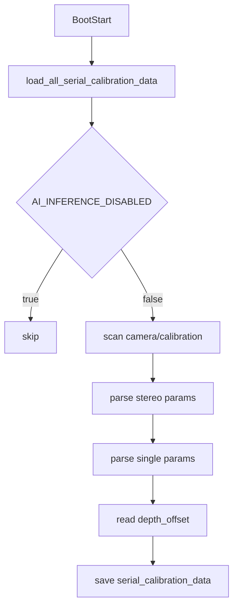
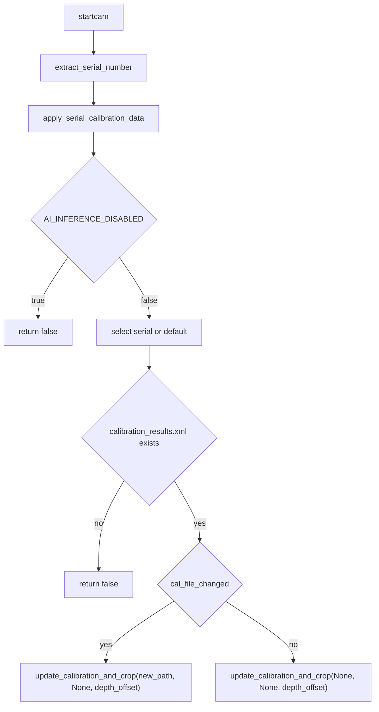
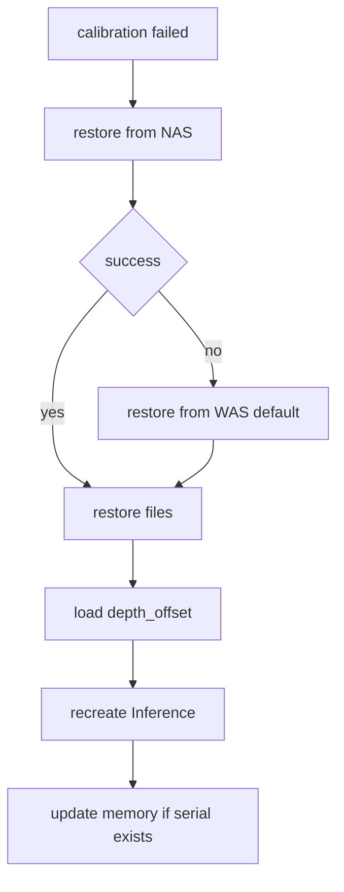

# calibration_manager.py 캘리브레이션 모듈 문서

## 개요

`calibration_manager.py`는 캘리브레이션 결과를 **메모리에 적재**하고, **시리얼별로 적용**하며, **복원/정리/에러 분류**를 담당합니다.
실제 캘리브레이션 계산 및 API 엔드포인트 처리는 `control.py`에서 수행됩니다.

## 주요 기능

- 부팅 시 `camera/calibration` 하위 폴더를 스캔해 메모리에 적재
- startcam 시 시리얼 넘버 기준으로 Inference에 적용
- 캘리브레이션 실패 시 NAS 또는 WAS default 폴더로 복원
- WAS 로컬 캘리브레이션 데이터 정리
- 오류 메시지 기반 에러 코드 분류

---

## 전역 데이터 구조

### `serial_calibration_data`

```python
serial_calibration_data = {
    "serial_number": {
        "cal_file_path": str,
        "cal_file_path_s": Optional[str],
        "stereo_cal_params": Optional[dict],
        "single_cal_params": Optional[dict],
        "depth_offset": Optional[float]
    },
    "default": { ... }
}
```

### `stereo_cal_params`

```python
{
    "mtx_l": numpy.ndarray,
    "mtx_r": numpy.ndarray,
    "K_l": numpy.ndarray,
    "K_r": numpy.ndarray,
    "dist_l": numpy.ndarray,
    "dist_r": numpy.ndarray,
    "R": numpy.ndarray,
    "t": numpy.ndarray,
    "origin_size": List[int]  # [width, height]
}
```

### `single_cal_params`

```python
{
    "mtx_s": numpy.ndarray,
    "K_s": numpy.ndarray,
    "dist_s": numpy.ndarray,
    "R_s": numpy.ndarray,
    "t_s": numpy.ndarray
}
```

---

## 핵심 함수

### `extract_serial_number`
메타데이터에서 `serialNumber`를 추출합니다. 없으면 빈 문자열을 반환합니다.

### `_parse_stereo_calibration_params`
- `load_calibration_results`로 스테레오 파라미터를 로드합니다.
- XML의 `img_width`, `img_height`를 읽어 `origin_size`를 구성합니다.
- 실패 시 `None`을 반환합니다.

### `_parse_single_calibration_params`
- `load_calibration_results_single`로 싱글 파라미터를 로드합니다.
- 실패 시 `None`을 반환합니다.

### `load_all_serial_calibration_data`
부팅 시 전체 폴더를 순회하여 메모리에 적재합니다.

핵심 흐름:
1. `AI_INFERENCE_DISABLED`면 로드 스킵
2. `camera/calibration` 하위 폴더 순회
3. 스테레오/싱글 파라미터 파싱 및 `depth_offset` 로드
4. `serial_calibration_data`에 저장

로그 형식(폴더별 1줄):
```
✅ 'i26A01-Z00001': stereo=ok, single=none, depth_offset=invalid
```

### `print_serial_calibration_data`
메모리에 적재된 시리얼 데이터 상세를 출력합니다.

### `update_serial_calibration_data` / `remove_serial_calibration_data`
메모리 딕셔너리의 항목을 업데이트/삭제합니다.

### `apply_serial_calibration_data`
startcam 시 시리얼 기준으로 Inference에 적용합니다.

핵심 흐름:
1. `AI_INFERENCE_DISABLED` 확인
2. 시리얼 키 선택(없으면 default)
3. `calibration_results.xml` 존재 확인
4. 변경 여부에 따라 `update_calibration_and_crop` 호출

### `_restore_calibration_from_nas`
캘리브레이션 실패 시 NAS 또는 WAS default 폴더에서 복원합니다.

핵심 흐름:
1. NAS 최신 타임스탬프 폴더에서 복원 시도
2. 실패 시 WAS default 폴더에서 복원
3. `depth_offset` 로드 및 Inference 재생성
4. (시리얼이 있으면) 메모리 데이터 업데이트

### `_cleanup_was_calibration_data`
WAS 로컬 캘리브레이션 디렉토리를 정리합니다.

### `_classify_calibration_error`
오류 메시지를 에러 코드로 분류합니다.

---

## 동작 흐름

### 부팅 시 메모리 로드



### startcam 시 캘리브레이션 적용



### 복원 프로세스(실패 시)



---

## 데이터 저장 위치

### WAS 로컬

```
camera/calibration/
├── {serial_number}/
│   ├── calibration_results.xml
│   ├── calibration_results_single.xml (선택)
│   └── temp/depth_offset.txt
└── default/
    ├── calibration_results.xml
    ├── calibration_results_single.xml (선택)
    └── temp/depth_offset.txt
```

### NAS

```
/mynas/{savePath}/{serial_number}/
└── {timestamp}/
    ├── calibration_results.xml
    ├── calibration_results_single.xml (선택)
    └── temp/depth_offset.txt
```

---

## 관련 파일

- `app/core/Artis_AI/camera/calibration_manager.py`
- `app/core/Artis_AI/camera/utils.py`
- `app/api/control.py`
- `app/core/Artis_AI/depth.py`
- `app/core/Artis_AI/inference_cloud.py`
- `app/core/Artis_AI/bbox_transformer.py`
