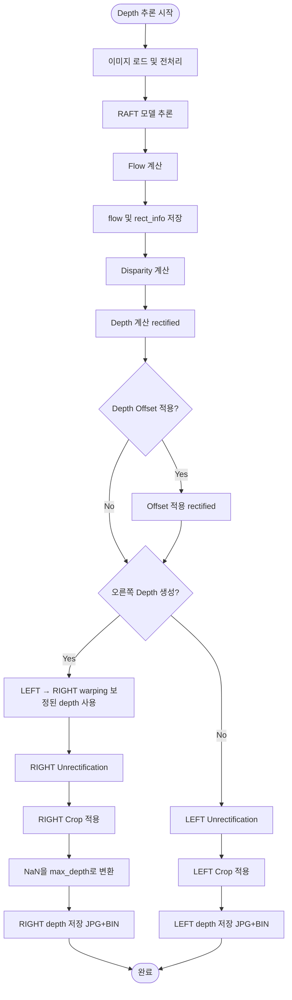
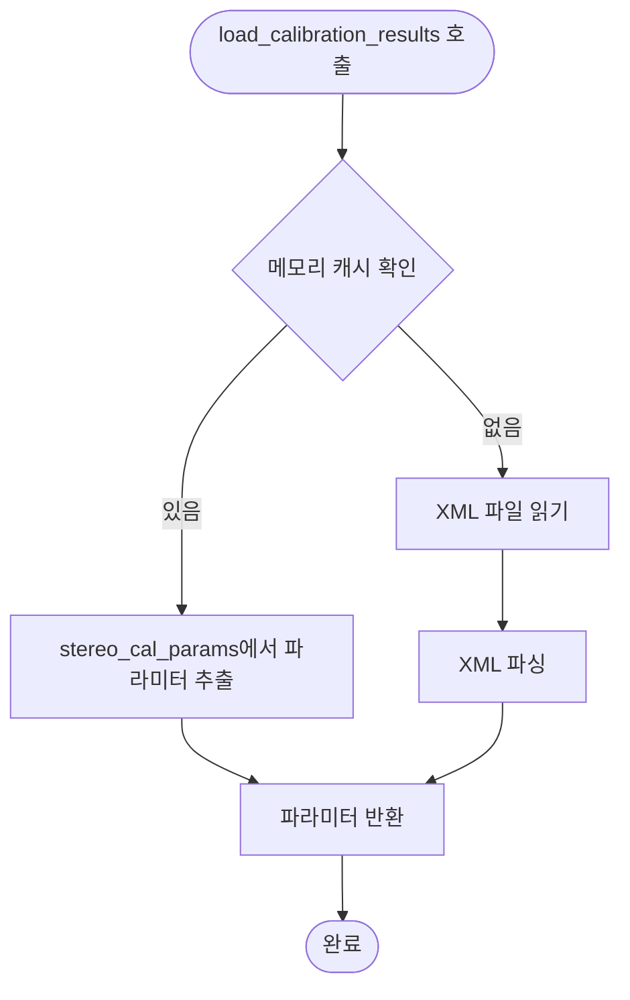
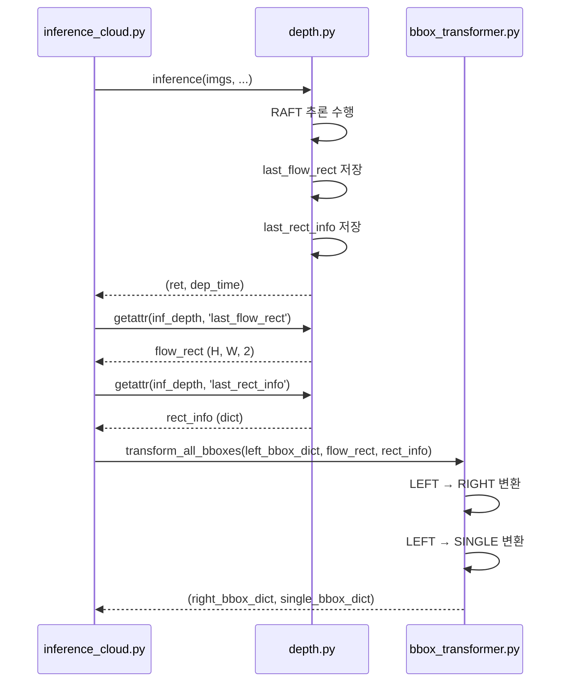

# depth.py 모듈 문서

## 개요

`depth.py` 모듈은 RAFT (Recurrent All-Pairs Field Transforms) 기반 스테레오 depth 추정을 수행하는 모듈입니다. 
LEFT와 RIGHT 카메라 이미지를 입력받아 depth map을 생성하고, 좌표변환을 위한 rectification 정보를 제공합니다.

## 주요 기능

- **RAFT 기반 Depth 추정**: LEFT와 RIGHT 카메라 이미지로부터 depth map 생성
- **메모리 캐시 활용**: `serial_calibration_data`에서 캘리브레이션 파라미터를 우선 로드하여 성능 최적화
- **Rectification 정보 제공**: 좌표변환을 위한 `rect_info` 딕셔너리 생성 및 저장
- **오른쪽 카메라 Depth 생성**: LEFT depth를 warping하여 RIGHT 카메라 depth 생성
- **Depth Offset 계산**: 캘리브레이션 시 depth 보정값 자동 계산 및 저장
- **좌표변환 연동**: `bbox_transformer.py`에서 사용할 flow와 rect_info 제공

## Depth 클래스

### 초기화

```python
Depth(cal_file_path, depth_range, crop_args, config_file_path)
```

**파라미터**:
- `cal_file_path`: calibration_results.xml 파일 경로 (None이면 depth 비활성화)
- `depth_range`: [min_depth, max_depth] 리스트 (mm)
- `crop_args`: [crop_lx, crop_ly, crop_rx, crop_ry, crop_width, crop_height] 리스트
- `config_file_path`: 설정 파일 경로

**동작**:
1. RAFT 모델 로드 및 초기화
2. 캘리브레이션 파라미터 로드 (메모리 캐시 우선)
3. 카메라 파라미터 초기화 (undistortion, rectification 맵 생성)
4. Crop 설정 초기화
5. Rectification 정보 저장 (`rect_info`)

### 주요 속성

- `self.is_depth_enable`: Depth 기능 활성화 여부 (bool)
- `self.args`: RAFT 모델 설정 (argparse.Namespace)
- `self.model`: RAFT 모델 (torch.nn.Module)
- `self.device`: 계산 디바이스 ("cuda")
- `self.rect_info`: Rectification 정보 딕셔너리 (좌표변환용)
- `self.last_depth_rect`: 마지막 추론에서 생성된 depth map (rectified 좌표계, offset 적용 전)
- `self.last_flow_rect`: 마지막 추론에서 생성된 flow (rectified 좌표계, H, W, 2)
- `self.last_rect_info`: 마지막 추론에서 사용된 rect_info 스냅샷

====================================================================================
## 주요 메서드

### 1. load_model

**목적**: RAFT 모델 로드 및 초기화

**파라미터**:
- `cal_file_path`: calibration 파일 경로
- `config_file_path`: 설정 파일 경로

**동작**:
1. RAFT 체크포인트 경로 확인 (`cc.artis_ai_gen_depth_model_path`)
2. 모델 로드 및 GPU로 이동
3. 평가 모드 설정

**반환값**: 없음 (실패 시 `is_depth_enable = False`)

====================================================================================
### 2. load_calibration_results

**목적**: 캘리브레이션 파라미터 로드 (메모리 캐시 우선 사용)

**파라미터**:
- `depth_range`: [min_depth, max_depth] 리스트

**동작**:
1. **메모리 캐시 우선 사용**: `serial_calibration_data`에서 `cal_file_path`가 일치하는 항목 찾기
   - `stereo_cal_params`에서 파라미터 추출
   - `origin_size` 포함
   - 성공 시 즉시 반환
2. **캐시에 없으면 파일에서 로드**: XML 파일 파싱
   - `mtx_l`, `mtx_r`, `K_l`, `K_r`, `dist_l`, `dist_r`, `R`, `t` 읽기
   - `img_width`, `img_height`에서 `origin_size` 추출
   - `min_depth`, `max_depth` 설정

**반환값**: `(mtx_l, K_l, dist_l, mtx_r, K_r, dist_r, R, t, origin_size)`

**특징**:
- 메모리 캐시 우선 사용으로 파일 I/O 최소화
- 부팅 시 로드된 파라미터를 재사용하여 성능 향상

====================================================================================
### 3. init_cam_params

**목적**: 카메라 파라미터 초기화 및 rectification 맵 생성

**파라미터**:
- `depth_range`: [min_depth, max_depth] 리스트
- `crop_args`: [crop_lx, crop_ly, crop_rx, crop_ry, crop_width, crop_height] 리스트

**동작**:
1. **캘리브레이션 파라미터 로드**: `load_calibration_results` 호출
2. **이미지 크기 스케일 계산**: 원본 크기 대비 리사이즈 스케일 계산
3. **Undistortion 맵 생성**: 왜곡 보정 맵 생성
4. **카메라 매트릭스 스케일링**: 리사이즈된 이미지 크기에 맞게 매트릭스 조정
5. **Rectification 맵 생성**: `stereoRectify(mtx, dist, ...)` 기반 rectification 맵 생성
6. **Rect → Orig 맵 생성**: `_get_orig_to_rect_map`으로 왜곡을 반영한 역변환 맵 생성
7. **Crop 설정 저장**: 원본 및 리사이즈된 crop 좌표 저장
8. **Rectification 정보 저장**: `_store_rect_info` 호출

**생성되는 맵**:
- `undist_map_l_x`, `undist_map_l_y`: LEFT undistortion 맵
- `undist_map_r_x`, `undist_map_r_y`: RIGHT undistortion 맵
- `rect_map_l_x`, `rect_map_l_y`: LEFT rectification 맵
- `rect_map_r_x`, `rect_map_r_y`: RIGHT rectification 맵
- `unrect_map_l_x`, `unrect_map_l_y`: LEFT rect → orig 맵 (왜곡 반영)
- `unrect_map_r_x`, `unrect_map_r_y`: RIGHT rect → orig 맵 (왜곡 반영)
- `dist_map_l_x`, `dist_map_l_y`: LEFT distortion 맵

====================================================================================
### 4. _store_rect_info

**목적**: Rectification 정보를 딕셔너리로 저장 (좌표변환용)

**파라미터**:
- `mtx_l`, `K_l`, `dist_l`: LEFT 카메라 파라미터
- `mtx_r`, `K_r`, `dist_r`: RIGHT 카메라 파라미터
- `R`, `t`: LEFT→RIGHT 상대 pose
- `rect_l`, `proj_l`: LEFT rectification 행렬
- `rect_r`, `proj_r`: RIGHT rectification 행렬
- `origin_size`: 원본 이미지 크기 [width, height]

**동작**:
- `self.rect_info` 딕셔너리에 모든 rectification 정보 저장
- `bbox_transformer.py`에서 사용할 수 있도록 키 이름 맞춤

**저장되는 정보(주요 키)**:
```python
self.rect_info = {
    "mtx_l": mtx_l,
    "dist_l": dist_l,
    "R1": rect_l,
    "P1": proj_l,
    "fx": fx,
    "fy": fy,
    "cx": cx,
    "cy": cy,
    "map2_orig_x": self.unrect_map_r_x,
    "map2_orig_y": self.unrect_map_r_y,
    "image_size": self.args.image_size,
    "origin_size": origin_size,
    "ori_crop_lx": ...,
    "ori_crop_ly": ...,
    "crop_w": ...,
    "crop_h": ...,
    "resize_scale_x": ...,
    "resize_scale_y": ...,
    "resize_crop_lx": ...,
    "resize_crop_ly": ...
}
```

====================================================================================
### 4-1. _get_rect_info

**목적**: 저장된 rectification 정보를 반환

**파라미터**: 없음

**동작**:
- `self.rect_info` 딕셔너리를 반환
- `rect_info`가 없으면 `None` 반환

**반환값**: `rect_info` 딕셔너리 또는 `None`

**사용 예시**:
```python
rect_info = self._get_rect_info()
if rect_info is not None:
    # rectification 정보 사용
    pass
```

**참고**: `inference` 메서드에서 `last_rect_info`를 저장할 때 이 메서드를 사용합니다.

====================================================================================
### 5. load_image

**목적**: LEFT와 RIGHT 이미지를 로드하고 전처리

**파라미터**:
- `imfile_l`: LEFT 이미지 파일 경로
- `imfile_r`: RIGHT 이미지 파일 경로

**동작**:
1. 이미지 파일 읽기
2. Crop 설정 업데이트 (config에서 최신 값 읽기)
3. 이미지 리사이즈 (crop 영역만)
4. Rectification 적용
5. RGB 변환 및 텐서 변환
6. GPU로 이동

**반환값**: `(image1, image2)` - 전처리된 이미지 텐서 (GPU)

====================================================================================
### 6. make_input_image

**목적**: 입력 이미지를 전처리하고 crop

**파라미터**:
- `img`: 입력 이미지 (numpy array)
- `camera_type`: 카메라 타입 (`CamInfo.LEFT`, `CamInfo.RIGHT`, `CamInfo.SINGLE`)
- `bFlagLDC`: Lens Distortion Correction 플래그

**동작**:
1. **LEFT 카메라** (`CamInfo.LEFT`):
   - LDC 적용 (있는 경우)
   - LEFT crop 좌표 사용
2. **RIGHT 카메라** (`CamInfo.RIGHT`):
   - LDC 적용 (있는 경우)
   - RIGHT crop 좌표 사용
3. **SINGLE 카메라** (`CamInfo.SINGLE`):
   - 중앙 center crop

**반환값**: 전처리된 이미지 (numpy array)

====================================================================================
### 7. inference

**목적**: Depth 추론 수행 및 결과 저장

**파라미터**:
- `imgs`: [dummy, img_l, img_r] 리스트
- `is_debug`: 디버그 모드 여부
- `save_path`: 결과 저장 경로
- `run_mode`: 실행 모드
- `depth_offset`: Depth 보정값 (mm)

**동작**:
1. **이미지 전처리**: `load_image` 호출
2. **RAFT 추론**: Flow 계산
3. **Flow 및 Rectification 정보 저장**:
   - `self.last_depth_rect`: rectified 좌표계의 depth map (offset 적용 전)
   - `self.last_flow_rect`: rectified 좌표계의 flow (H, W, 2)
   - `self.last_rect_info`: rectification 정보 딕셔너리 스냅샷
4. **Disparity 계산**: Flow에서 disparity 추출
5. **Depth 계산**: `depth = fx / disp * baseline`
6. **Depth 보정 값 적용** (rectified 좌표계에서, warping 전):
   - 유효한 depth 값에만 적용
   - 왼쪽 rectified depth에 적용하면 warping 시 오른쪽도 자동 보정됨
7. **오른쪽 Depth 생성 및 보간**:
   - `_calc_disp_from_left_flow`: LEFT flow → disparity
   - `_warp_left_depth_to_right_rect`: LEFT depth → RIGHT depth warping
   - `_interpolate_depth_holes`: RIGHT rect depth 보간
8. **Unrectification**: rectified depth → original 좌표계
9. **Crop 적용**: crop 영역만 추출
10. **LEFT depth 저장**:
    - `_save_depth_jpg`: JPG 파일 저장 (컬러맵)
    - `_save_depth_bin`: BIN 파일 저장 (헤더 정보 포함)
11. **RIGHT depth 저장** (있는 경우):
   - NaN/Inf를 `max_depth`로 변환
   - `_save_depth_jpg`: JPG 파일 저장
   - `_save_depth_bin`: BIN 파일 저장 (헤더 정보 재사용)

**반환값**: `(ret, dep_time)` - 성공 여부 및 소요 시간 (ms)

**특징**:
- 좌표변환을 위해 `last_flow_rect`와 `last_rect_info`를 저장
- `bbox_transformer.py`에서 이 정보를 사용하여 bbox 변환 수행
- Depth offset은 rectified 좌표계에서 적용하여 왼쪽과 오른쪽 모두 자동 보정
- 헤더 정보는 한 번만 생성하고 오른쪽 저장 시 재사용하여 효율성 향상

====================================================================================
### 8. _save_depth_bin

**목적**: Depth 데이터를 bin 파일로 저장

**파라미터**:
- `depth`: uint16 depth 배열 (H, W)
- `filename`: 저장할 파일 경로 (.bin 확장자 포함)
- `header_info`: (len_byte_header, byte_header, header_version) 튜플

**동작**:
1. Depth 데이터를 uint16으로 변환 및 reshape
2. 헤더 정보 작성:
   - 헤더 길이 (uint16)
   - "Version" 문자열
   - 버전 정보 (major, minor, inner)
3. Depth 데이터 저장

**반환값**: `True` (성공) 또는 `False` (실패)

====================================================================================
### 9. _save_depth_jpg

**목적**: Depth 데이터를 JPG 파일로 저장 (컬러맵 적용)

**파라미터**:
- `depth`: depth 배열 (H, W)
- `filename`: 저장할 파일 경로 (.jpg 확장자 포함)
- `min_depth`: 최소 depth 값
- `max_depth`: 최대 depth 값

**동작**:
1. Depth 값을 min_depth~max_depth 범위로 클리핑
2. 정규화: 200~500mm → 255~0으로 역변환
3. uint8 변환 및 컬러맵 적용 (JET)
4. JPG 파일 저장

**반환값**: `True` (성공) 또는 `False` (실패)

====================================================================================
### 10. update_crop_settings

**목적**: Crop 설정 업데이트 (Depth 재생성 없이)

**파라미터**:
- `left_x`, `left_y`: LEFT 카메라 crop 좌표
- `right_x`, `right_y`: RIGHT 카메라 crop 좌표

**동작**:
1. 현재 crop 설정과 비교
2. 변경된 경우에만 업데이트
3. 리사이즈된 crop 좌표 재계산

**반환값**: 없음

====================================================================================
### 11. warm_up

**목적**: 모델 워밍업 (초기 추론 속도 최적화)

**파라미터**:
- `loop_max`: 최대 반복 횟수
- `dep_max`: 목표 추론 시간 (초)

**동작**:
1. 샘플 이미지로 반복 추론
2. 목표 시간 이하로 추론 시간이 떨어지면 종료
3. 최대 반복 횟수까지 시도

**반환값**: `(success, dep_time)` - 성공 여부 및 추론 시간

====================================================================================
### 11. _interpolate_depth_holes

**목적**: Depth 맵의 빈 영역(NaN/Inf)을 cv2.inpaint를 사용하여 보간

**파라미터**:
- `depth`: Depth 맵 (H, W) numpy array (NaN/Inf 포함 가능)

**동작**:
1. NaN/Inf 마스크 생성: 유효하지 않은 픽셀 식별
2. 정규화: Depth 값을 0-255 범위로 변환 (uint8)
   - `depth_normalized = ((depth_clean - depth_min) / depth_range * 255)`
   - 보간 대상 픽셀은 0으로 설정
3. Inpaint 적용: `cv2.inpaint`로 빈 영역 보간
   - `inpaintRadius=1`: 최소 반경으로 속도 우선
   - `flags=cv2.INPAINT_TELEA`: Fast Marching Method 기반 알고리즘
4. 역변환: 보간된 값을 원래 Depth 범위로 복원
5. 클리핑: min_depth ~ max_depth 범위로 제한

**반환값**: 보간된 depth 맵 (H, W) numpy array

**사용 예시**:
```python
depth_right_rect = self._interpolate_depth_holes(depth_right_rect)
```

**특징**:
- 작은 occlusion 영역 보간에 효과적
- 큰 occlusion 영역은 스킵 (원본 NaN 유지)
- 에러 발생 시 원본 반환 (안전장치)

====================================================================================
## 유틸리티 메서드 (Utility Methods)

### 1. _calc_disp_from_left_flow

**목적**: LEFT 기준 RAFT flow → disparity 변환

**파라미터**:
- `flow_left_to_right_rect`: LEFT→RIGHT rectified flow (H, W, 2) 또는 (H, W) numpy array

**동작**:
- Flow의 x 성분에서 disparity 계산: `disp = -du`
- 유효하지 않은 값(NaN, Inf, 음수) 제거하여 NaN으로 설정

**반환값**: Disparity map (H, W) numpy array (NaN 포함, 양수만 유효)

**사용 예시**:
```python
disp_left_rect = self._calc_disp_from_left_flow(flow_up.cpu().numpy())
```

====================================================================================
### 2. _warp_left_depth_to_right_rect

**목적**: LEFT rect 좌표계의 depth를 RIGHT rect 좌표계로 warping

**파라미터**:
- `depth_left`: LEFT rectified depth (H, W) numpy array
- `disp_left`: LEFT disparity (H, W) 또는 1D numpy array

**동작**:
1. Disparity shape 보정: 1D 배열이면 depth_left와 같은 shape으로 확장, 2D 배열이면 크기 불일치 시 리사이즈
2. Disparity를 사용하여 LEFT 픽셀을 RIGHT 좌표로 매핑: `u_right = u_left - disp`
3. Z-buffer 처리: 충돌 시 더 가까운 depth(작은 z) 유지 (`np.minimum.at` 사용)
4. Occlusion 영역(업데이트되지 않은 위치)은 NaN으로 유지

**반환값**: RIGHT rectified depth (H, W) numpy array (occlusion은 NaN)

**사용 예시**:
```python
disp_left_rect = self._calc_disp_from_left_flow(flow_np)
depth_right_rect = self._warp_left_depth_to_right_rect(depth, disp_left_rect)
```

**특징**:
- Warping 전에 depth_offset이 적용된 depth를 사용하면 오른쪽도 자동으로 보정됨
- 1D/2D disparity 배열 모두 지원 (자동 shape 보정)
- Vectorized 연산으로 성능 최적화

====================================================================================
## 모듈 레벨 함수들

### 1. crop_calibration_images

**목적**: 캘리브레이션 이미지 crop 처리

**파라미터**:
- `crop_settings`: Crop 설정 딕셔너리
- `temp_dir`: 임시 디렉토리 경로

**동작**:
1. `Cal_left.jpg`, `Cal_right.jpg` 읽기
2. Crop 설정에 따라 이미지 crop
3. `Cam_2_Color.jpg`, `Cam_1_Color.jpg`로 저장

**반환값**: `(output_img_l, output_img_r)` - Crop된 이미지 경로 또는 `(None, None)`

====================================================================================
### 2. calculate_depth_offset

**목적**: Depth 보정값 계산

**파라미터**:
- `depth_file`: Depth 바이너리 파일 경로

**동작**:
1. Depth 파일 읽기
2. 중앙 100×100 영역에서 유효 depth 값 추출
3. 유효 범위: `ref - 30` ~ `ref + 30` mm (기본 440~500mm)
4. IQR 기반 outlier 제거
5. 중앙값 계산 및 보정값 계산: `offset = ref - median_depth`
6. 보정값 범위 제한: 최대 ±50mm

**반환값**: Depth offset (mm) 또는 `None`

====================================================================================
### 3. save_depth_offset_to_file

**목적**: Depth offset을 파일에 저장

**파라미터**:
- `depth_offset`: Depth offset 값 (mm)
- `temp_dir`: 저장할 디렉토리 경로

**동작**:
- `temp_dir/depth_offset.txt` 파일에 저장

**반환값**: `True` (성공) 또는 `False` (실패)

====================================================================================
### 4. calculate_and_save_depth_offset

**목적**: Depth offset 계산 및 저장 (통합 함수)

**파라미터**:
- `crop_settings`: Crop 설정 딕셔너리
- `temp_dir`: 임시 디렉토리 경로
- `cmd_args`: 명령줄 인자 (선택적)

**동작**:
1. Depth 파일 존재 확인
2. 없으면 이미지 crop 후 depth 추론 수행
3. `calculate_depth_offset` 호출
4. `save_depth_offset_to_file` 호출

**반환값**: Depth offset (mm) 또는 `None`

====================================================================================
## 메모리 캐시 활용

### serial_calibration_data 연동

`load_calibration_results` 메서드는 메모리 캐시를 우선 사용합니다:

1. **캐시 우선 사용**: `serial_calibration_data`에서 `cal_file_path`가 일치하는 항목 찾기
2. **파라미터 추출**: `stereo_cal_params`에서 모든 파라미터 추출
3. **파일 읽기 스킵**: 캐시에 있으면 XML 파일 읽기 생략

**장점**:
- 부팅 시 로드된 파라미터 재사용
- 파일 I/O 최소화로 성능 향상
- Startcam 시 시리얼 넘버별 캘리브레이션 자동 적용

**캐시 구조**:
```python
serial_calibration_data[serial_number] = {
    "cal_file_path": str,
    "stereo_cal_params": {
        "mtx_l": numpy.ndarray,
        "mtx_r": numpy.ndarray,
        "K_l": numpy.ndarray,
        "K_r": numpy.ndarray,
        "dist_l": numpy.ndarray,
        "dist_r": numpy.ndarray,
        "R": numpy.ndarray,
        "t": numpy.ndarray,
        "origin_size": [width, height]
    },
    ...
}
```

====================================================================================
## 좌표변환 연동

### rect_info 제공

`Depth` 클래스는 `bbox_transformer.py`에서 사용할 rectification 정보를 제공합니다:

1. **rect_info 저장**: `_store_rect_info`에서 모든 rectification 정보를 딕셔너리로 저장
2. **추론 시 저장**: `inference` 메서드에서 `last_flow_rect`와 `last_rect_info` 저장
3. **bbox_transformer에서 사용**: `inference_cloud.py`에서 이 정보를 가져와 bbox 변환 수행

**사용 흐름**:
```python
# depth.py에서
self.last_flow_rect = flow_up.cpu().numpy()  # (H, W, 2)
self.last_rect_info = self._get_rect_info()  # dict

# inference_cloud.py에서
flow_rect = getattr(self.inf_depth, 'last_flow_rect', None)
rect_info = getattr(self.inf_depth, 'last_rect_info', None)

# bbox_transformer.py에서
right_bbox_dict, pillar_bbox_dict = transform_all_bboxes(
    left_bbox_dict,
    flow_rect,
    rect_info
)
```

====================================================================================
## 동작 흐름

### Depth 추론 전체 프로세스



### 캘리브레이션 파라미터 로드 프로세스



### 좌표변환 연동 프로세스



====================================================================================
## 주요 상수 및 설정

### RAFT 모델 설정

- `image_size`: [480, 768] (기본값)
- `valid_iters`: 7 (flow 업데이트 반복 횟수)
- `min_depth`: 400mm (기본값)
- `max_depth`: 650mm (기본값)

### Depth Offset 계산 설정

- `window_size`: 100×100 픽셀 (중앙 영역)
- `valid_range`: ±30mm (기본 440~500mm)
- `max_offset`: ±50mm (최대 보정값)
- `min_valid_ratio`: 50% (유효값 최소 비율)

====================================================================================
## 파일 구조

```
depth.py
├── Depth 클래스
│   ├── __init__: 초기화
│   ├── load_model: 모델 로드
│   ├── load_calibration_results: 캘리브레이션 파라미터 로드
│   ├── init_cam_params: 카메라 파라미터 초기화
│   ├── _store_rect_info: Rectification 정보 저장
│   ├── _get_rect_info: Rectification 정보 반환
│   ├── inference: Depth 추론
│   ├── load_image: 이미지 전처리
│   ├── make_input_image: 입력 이미지 전처리 및 crop
│   ├── update_crop_settings: Crop 설정 업데이트
│   ├── warm_up: 모델 워밍업
│   ├── _save_depth_bin: Depth bin 파일 저장
│   ├── _save_depth_jpg: Depth jpg 파일 저장
│   ├── disparity_from_flow_left_ref: Flow → Disparity 변환
│   └── warp_depth_left_to_right_fast: LEFT → RIGHT depth warping
├── crop_calibration_images: 캘리브레이션 이미지 crop
├── calculate_depth_offset: Depth offset 계산
├── save_depth_offset_to_file: Depth offset 저장
└── calculate_and_save_depth_offset: 통합 함수
```

====================================================================================
## 연관 모듈

- `app/core/Artis_AI/camera/calibration_manager.py`: 
  - `serial_calibration_data`에서 스테레오 파라미터 로드
  - 메모리 캐시 우선 사용
- `app/core/Artis_AI/bbox_transformer.py`: 
  - `last_flow_rect`와 `last_rect_info` 사용
  - LEFT bbox를 RIGHT와 SINGLE로 변환
- `app/core/Artis_AI/inference_cloud.py`: 
  - `Depth` 인스턴스 생성 및 관리
  - 추론 후 flow와 rect_info를 bbox_transformer에 전달
- `app/core/Artis_AI/camera/utils.py`: 
  - `load_calibration_results` 함수 (파일에서 로드 시 사용)

====================================================================================
## 사용 예시

### Depth 인스턴스 생성

```python
from depth import Depth

cal_file_path = "./camera/calibration/default/calibration_results.xml"
depth_range = [200, 500]  # min_depth, max_depth (mm)
crop_args = [180, 0, 130, 0, 1600, 1200]  # [lx, ly, rx, ry, width, height]
config_file_path = "./kisan_config.json"

depth = Depth(cal_file_path, depth_range, crop_args, config_file_path)
```

### Depth 추론

```python
imgs = [dummy, img_l_path, img_r_path]
ret, dep_time = depth.inference(imgs, False, "./", "UserRun", depth_offset=10.5)
```

### make_input_image 사용

```python
from common_config import CamInfo

# LEFT 카메라 이미지 전처리
img_left = depth.make_input_image(img, CamInfo.LEFT, bFlagLDC=True)

# RIGHT 카메라 이미지 전처리
img_right = depth.make_input_image(img, CamInfo.RIGHT, bFlagLDC=True)

# SINGLE 카메라 이미지 전처리 (중앙 crop)
img_single = depth.make_input_image(img, CamInfo.SINGLE, bFlagLDC=False)
```

### 좌표변환을 위한 정보 가져오기

```python
# inference_cloud.py에서
flow_rect = getattr(self.inf_depth, 'last_flow_rect', None)
rect_info = getattr(self.inf_depth, 'last_rect_info', None)

if flow_rect is not None and rect_info is not None:
    right_bbox_dict, pillar_bbox_dict = transform_all_bboxes(
        left_bbox_dict,
        flow_rect,
        rect_info
    )
```

====================================================================================
## 주의사항

1. **메모리 캐시 우선**: `load_calibration_results`는 메모리 캐시를 우선 사용하므로, 부팅 시 `load_all_serial_calibration_data`가 먼저 실행되어야 합니다.

2. **rect_info 저장**: 좌표변환을 위해서는 `_store_rect_info`가 정상적으로 호출되어야 합니다. `init_cam_params`에서 자동 호출됩니다.

3. **flow 및 rect_info 저장**: 추론 후 `last_flow_rect`와 `last_rect_info`가 저장되므로, 좌표변환은 추론 직후에 수행해야 합니다.

4. **Depth Offset 적용**: `depth_offset`이 0이 아니고 None이 아니면 rectified 좌표계에서 자동으로 적용됩니다. 왼쪽 rectified depth에 적용하면 warping 시 오른쪽도 자동으로 보정됩니다.

5. **오른쪽 Depth 생성**: `warp_depth_left_to_right_fast`는 선택적 기능입니다. 실패해도 LEFT depth는 정상적으로 저장됩니다. 오른쪽 depth의 NaN/Inf 값은 `max_depth`로 변환됩니다.

6. **CamInfo Enum 사용**: `make_input_image` 함수는 `CamInfo` Enum을 사용하여 카메라 타입을 명확하게 구분합니다 (`CamInfo.LEFT`, `CamInfo.RIGHT`, `CamInfo.SINGLE`).

7. **헤더 정보 재사용**: BIN 파일 저장 시 헤더 정보는 한 번만 생성하고 왼쪽/오른쪽 저장 시 재사용하여 효율성을 높입니다.